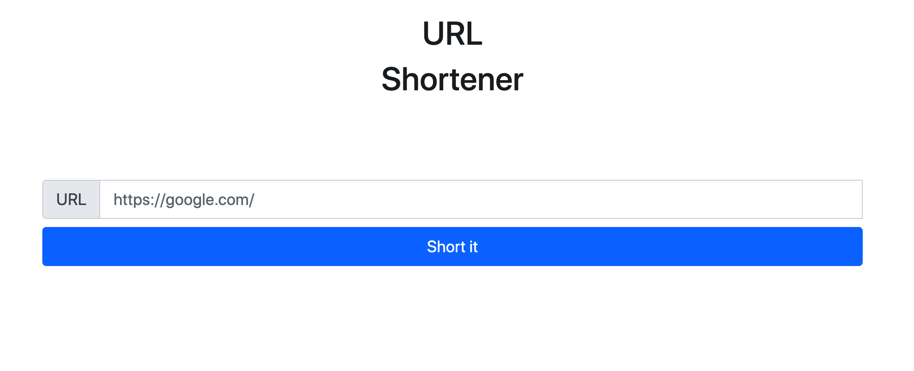
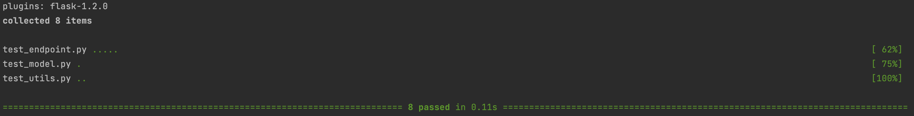

# Url_Shortener

 ```
 git clone https://github.com/Ihor-Kalhanov/Url_Shortener.git
````

```
cd Url_Shortener/
````

```
make build 
````

<h1>The main page</h1>




['POST']- "http://0.0.0.0:5000/short"

```
{
  "base_url": "string"
}
````

<h2>After you requested, you can see response</h2>

```
{
  "result": "Your new short url"
}
````

## <h1>The EXTRA FEATURES</h1>

<h2>Features 1</h1>
We have an endpoint `/shortened_urls_count` to which we throw a query to get how many people went on a short url

['POST']- `/shortened_urls_count`

```
{
  "url_count": "your_url"
}
````

RESPONSE BODY

```
{
  "count_url": 'count_of_your_url'
}
````

### But if you follow the link several times from one IP address, it will change only once and no more.

### For example, the user clicks on the link 20 times, but the count will increase only by 1

<h2>Features 2</h1>

### We can look at the top 10 links by the most popular people

['GET'] - `/shortened_urls_count`

### As a result we can see

```
{
  "10 most popular urls": {
    "url: <your url1 >": "count - 10",
    "url: <your url2 >": "count - 9",
    "url: <your url3 >": "count - 8",
    "url: <your url4 >": "count - 7",
    "url: <your url5 >": "count - 6",
    "url: <your url6 >": "count - 5",
    "url: <your url7 >": "count - 4",
    "url: <your url8 >": "count - 3",
    "url: <your url9 >": "count - 2",
    "url: <your url10 >": "count - 1",
  }
}
````
## <h1>Setup tests</h1>
```
pytest web/tests
````

