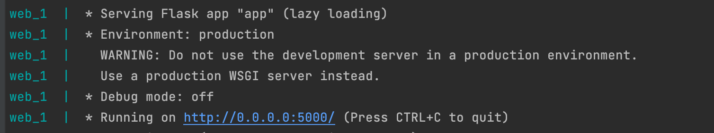
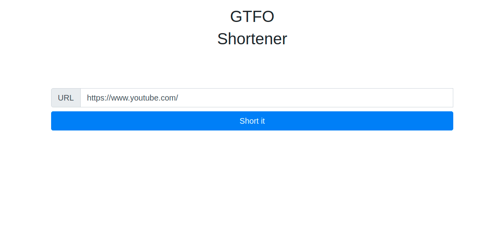

# Url_Shortener

 ```
 git clone https://github.com/Ihor-Kalhanov/Url_Shortener.git
````
```
cd Url_Shortener/
````
```
docker-compose up --build 
````
  
 
  

<h1>The main page</h1>

  


['POST']- "http://0.0.0.0:5000/short"


```
{
  "base_url": "string"
}

````
After you requested, you can see response
```
{
  "result": "Your new short url"
}
